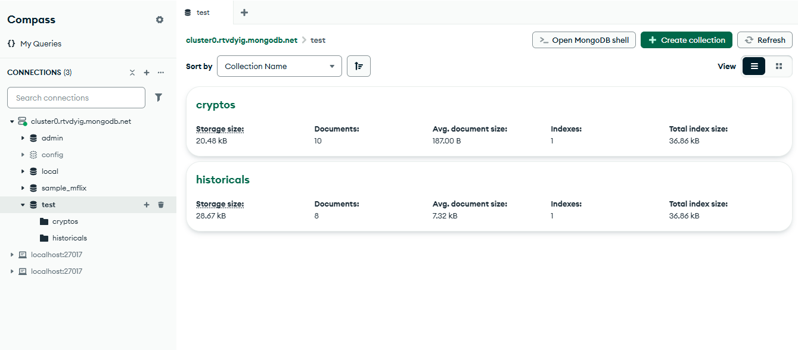
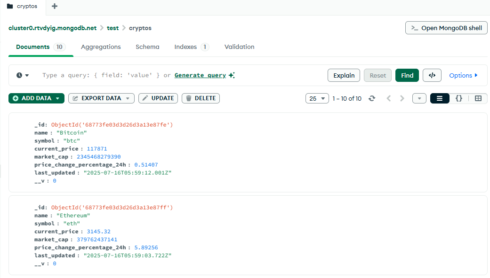
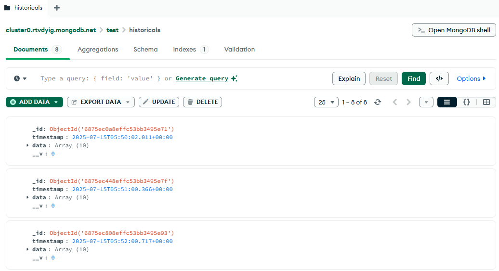
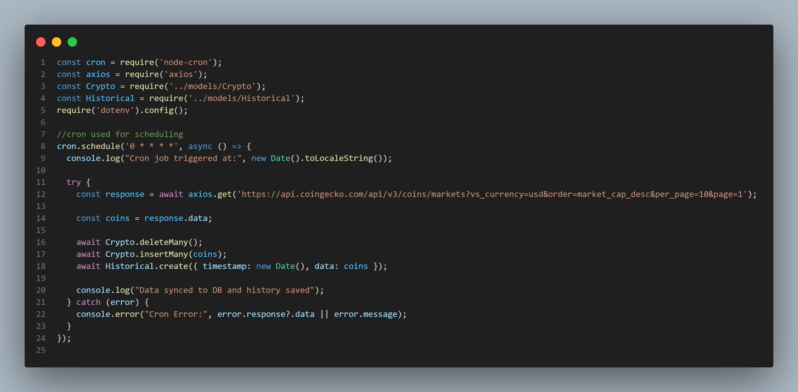

# Crypto Tracker

## 🧠 Tech Stack
- MongoDB
- Express.js
- React
- Node.js
- CoinGecko API

## 🚀 Features
- Fetch top 10 crypto coins (name, symbol, price, market cap, 24h %, updated time)
- Stores snapshot every hour using cron
- History retrieval for individual coins

## 📦 API Endpoints
- GET /api/coins
- POST /api/history
- GET /api/history/:coinId

## 🗃 Database
- Collection 1: Crypto (current)
- Collection 2: Historical (with timestamp)

## 🌍 Deployment
- Frontend: Vercel / Netlify
- Backend: Render
- Database: MongoDB Atlas

## ✅ Sample Output
- DB

- Cron

- front end url
https://crypt-o-tracker.netlify.app/
- back-end url
https://crypto-server-xsea.onrender.com/
